# SGE_BLOC2

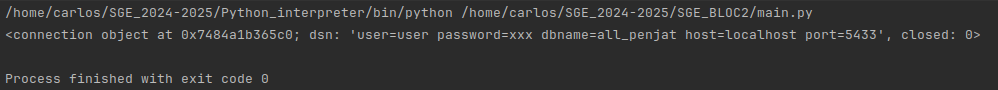
En esta imagen se muestra un print utilizando la funcion de connect. Se puede ver que la conexion ha sido establecia por el usuatio "user" a la base de datos "all_penjat"

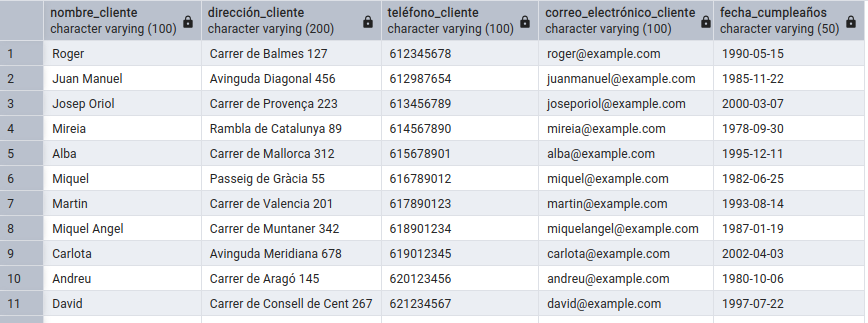

En esta imagen se puede comprobar qu ay he podidio ingresar los datos de los clientes a la base de datos.

Para conseguir esto he tenido que crear las tablas con este codigo:

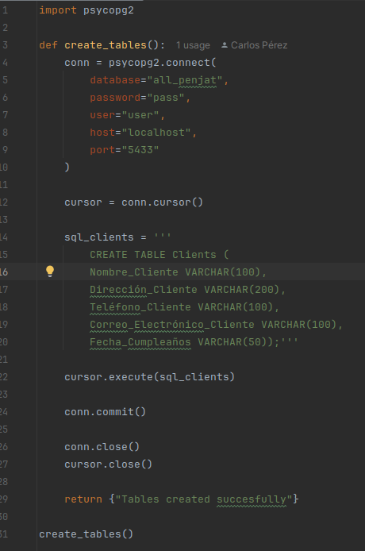

Una vez se han creado las tablas solo he tenido que tener mi csv con los datos preparados y iniciar el primero codigo de estos dos:

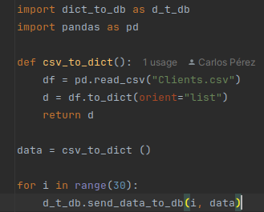
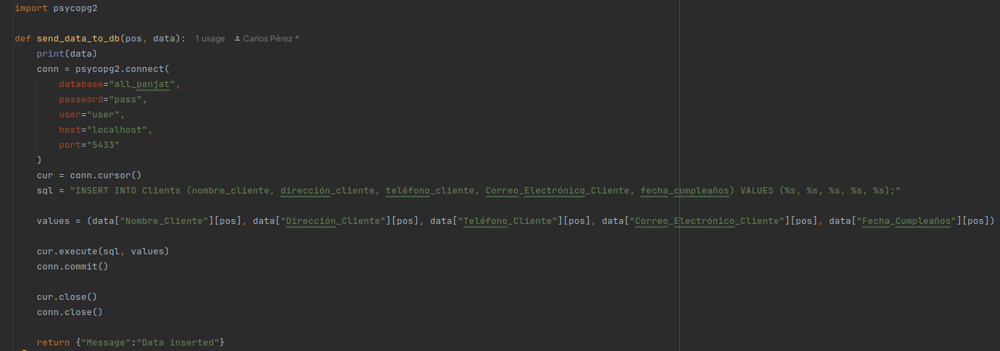

Aqui se puede ver como he podido crear un registro nuevo con la funcion de "create_registre"
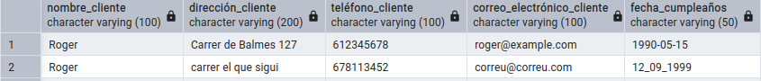

Aqui podemos ver un print simple de read_registre
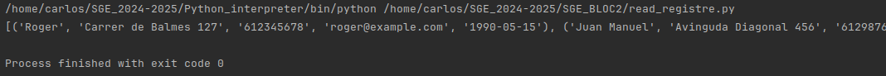

Este es el read_reg pero especificando una fila (la fila 4 en este caso)
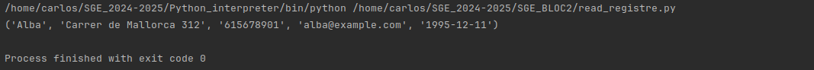

Este es el read_reg pero especificando fila y columna (en este caso es la fila 4, igual que el anterior y la columna 4)
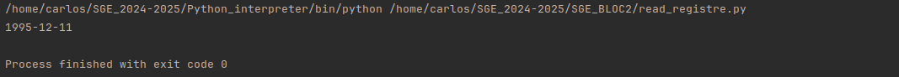

Aqui estan los siguientes datos:
- Les dades de l’Andreu
- El correu de l’Andreu
- Les dades de la Vivian
- La direcció de la Vivian
- Les dades de l’Albert
- La data de cumpleanys de l’Albert
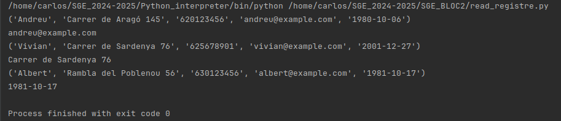

Aqui podemos ver la tabla de datos ordenada de manera que se entiende mejor que es cada dato
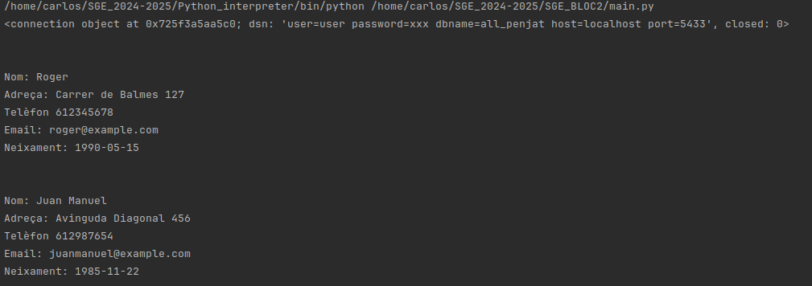

Aqui podemos ver como con el update_reg se han cambiado los numeros de telefono de estos 3 clientes
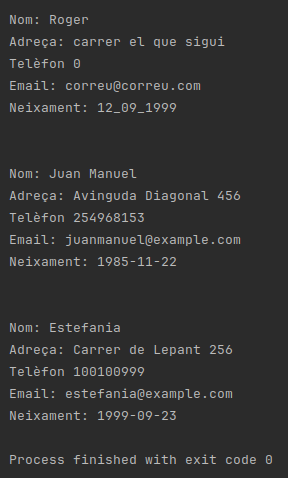